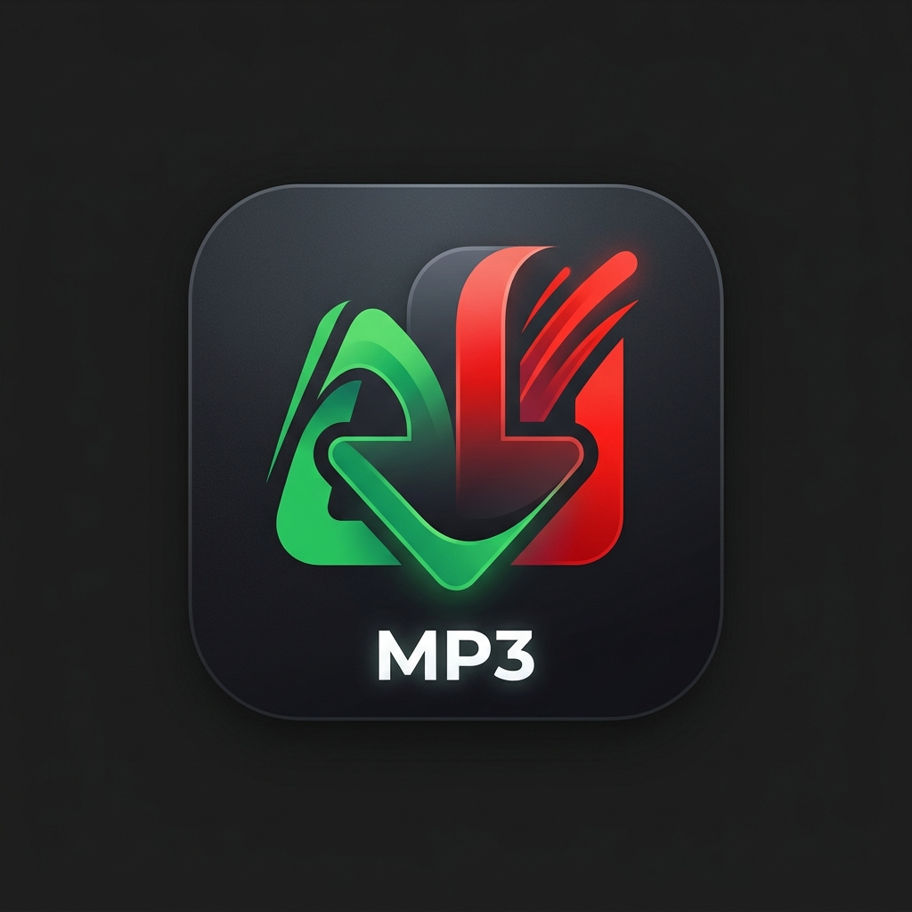

# 🎵 Spotify & YouTube Downloader - Premium Edition

<p align="center">
  
</p>

<p align="center">
  
  
  
  
</p>

---

Una aplicación de escritorio de alto rendimiento y estéticamente atractiva que te permite descargar canciones y listas de reproducción de **Spotify** o **YouTube** con la máxima calidad de audio posible, extrayendo metadatos oficiales y carátulas de álbumes automáticamente.

---

## ✨ Características Principales

*   🎨 **Interfaz Gráfica Adaptativa**: El color de la interfaz cambia dinámicamente según el enlace ingresado (**Verde Spotify** o **Rojo YouTube**) para una experiencia inmersiva.
*   ⚙️ **Motor Dual Inteligente**:
    *   **YouTube**: Utiliza `yt-dlp` para realizar descargas directas del audio de playlists o videos individuales, inyectando la miniatura del video como carátula de la pista y escribiendo los tags de autor.
    *   **Spotify**: Utiliza `spotdl` para emparejar la música con las pistas de YouTube Music, incrustando la carátula oficial en alta resolución, autor, álbum, fecha e incluso letras de canciones sincrónicas.
*   🚀 **Hilos en Segundo Plano**: Las descargas se realizan de forma asíncrona, manteniendo la ventana completamente responsiva. Incluye un botón para **Cancelar** descargas de forma segura.
*   🛠️ **Instalador de FFmpeg Integrado**: Detecta si tu sistema no cuenta con FFmpeg y permite descargarlo con un solo clic desde el panel de configuración lateral.
*   🤫 **Sin Ventanas de CMD Molestas**: Todo el procesamiento y las llamadas internas de conversión (FFmpeg) se ejecutan en silencio absoluto gracias a un parche global de subprocess.
*   📂 **Consola de Registro en Tiempo Real**: Te muestra a detalle el porcentaje de descarga, velocidad e información del archivo que se procesa en ese instante.

---

## 🖥️ Requisitos para Usuarios (Ejecutable)

Si solo quieres usar la aplicación en Windows, no necesitas tener instalado Python.
1. Descarga el ejecutable desde la carpeta `dist/` o mediante este enlace directo:
   👉 **[downloader_app.exe](dist/downloader_app.exe)**
2. Ejecútalo en tu PC.
3. Abre el panel lateral y, si dice *FFmpeg: No detectado*, haz clic en **Instalar FFmpeg**. Esto descargará el complemento necesario para las conversiones.
4. ¡Pega tu enlace y empieza a descargar!

---

## 🛠️ Instalación para Desarrolladores

Si deseas correr la aplicación desde el código fuente o modificarla:

### 1. Clonar el repositorio
```bash
git clone https://github.com/tu-usuario/nombre-repositorio.git
cd nombre-repositorio
```

### 2. Configurar el Entorno Virtual
```bash
python -m venv .venv
.venv\Scripts\activate
```

### 3. Instalar Dependencias
```bash
pip install -r requirements.txt
```

### 4. Ejecutar la Aplicación
```bash
python downloader_app.py
```

### 5. Compilar tu propio ejecutable (.exe)
Si haces modificaciones y quieres compilar tu propia versión ejecutable de Windows:
```bash
pyinstaller --onefile --windowed --icon=app_icon.ico --collect-all customtkinter --collect-all tls_client --collect-all curl_cffi --collect-all pykakasi --collect-all ytmusicapi downloader_app.py
```

---

## 🔑 Configuración de Credenciales de Spotify (Playlists)

Para descargar canciones individuales no requieres configuraciones adicionales. Sin embargo, para procesar **listas de reproducción (playlists) completas de Spotify**, necesitas añadir tus credenciales gratuitas para evitar bloqueos del servidor:

1. Visita el [Spotify Developer Dashboard](https://developer.spotify.com/) e inicia sesión.
2. Presiona **Create App** (Crear aplicación).
3. Rellena los datos (en *Redirect URI* coloca `http://localhost:8888/callback`).
4. Ve a los **Settings** de tu app para obtener el **Client ID** y el **Client Secret**.
5. Abre la aplicación de escritorio y pégalos en la barra lateral de configuración. Presiona **Guardar Configuración**.

---

## 📄 Licencia

Este proyecto está bajo la Licencia MIT. Consulta el archivo para más detalles.
